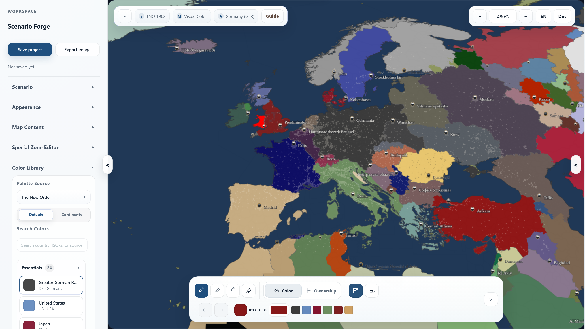
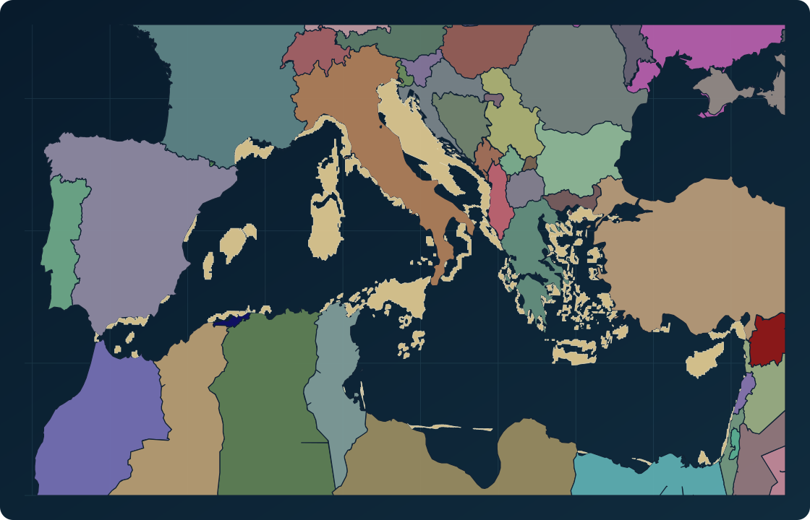
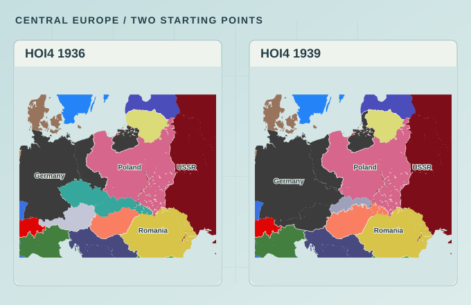

<div align="center">
  
  <h1>Scenario Forge</h1>
  <p><strong>Make a world your own.</strong></p>
  <p>A political map studio for alternate history and worldbuilding.</p>
  <p>
    <a href="https://raederhans.github.io/scenario-forge/app/?view=guide">Open editor ↗</a>
    &nbsp; · &nbsp;
    <a href="https://raederhans.github.io/scenario-forge/#sample-runs">Explore maps</a>
    &nbsp; · &nbsp;
    <a href="README.zh-CN.md">简体中文</a>
  </p>
</div>



## From a starting point to your own map

- **Choose a world.** Start from Blank Map, Modern World, HOI4 1936, HOI4 1939, or TNO 1962.
- **Reshape the story.** Edit ownership and control, draw frontlines, and add labels and strategic markings.
- **Compose the details.** Tune palettes, borders, and legends; add cities, roads, rail, terrain, and rivers.
- **Keep creating.** Work in English or Chinese, export PNG/JPG with resolution-aware map rendering, and save editable JSON projects. Choose 1×–4× within the export size and memory limits.

## Selected maps

These overview maps are generated from project data. They illustrate scenario geography and composition; they are not screenshots of the sample projects’ default exports. HOI4 and TNO maps depict game or alternate-history settings.

### An altered Mediterranean



TNO 1962 ownership and country colours, with Atlantropa land, shoals, and water.

[Open the TNO sample](https://raederhans.github.io/scenario-forge/app/?sample=tno-1962-atlantropa-briefing&view=guide) · [Vector map](landing/assets/work-alt-history-med.svg)

### Europe, between two dates



Compare two HOI4 baselines across the same region.

[Open 1936](https://raederhans.github.io/scenario-forge/app/?sample=hoi4-1936-europe-briefing&view=guide) · [Open 1939](https://raederhans.github.io/scenario-forge/app/?sample=hoi4-1939-europe-switch&view=guide) · [All sample files](landing/assets/sample-runs.json)

## Run locally

On Windows, with Python 3 installed and the required runtime assets present, run:

```powershell
.\start_dev.bat
```

The launcher prints the local editor URL. See [local development](docs/local-development.md) for setup, runtime assets, backend previews, and development commands.

## Availability and sources

The public editor includes the five baselines above. HGO 1936 is a developer/local preview; Cloud Saves and community features require the local backend preview. Roads and rail are the strongest public transport layers; other transport and thematic families have varying preview coverage.

Code and documentation use the [MIT License](LICENSE). Third-party datasets and derived maps retain their source-specific terms. Consult the [source ledger](data/source_ledger.json) and the map metadata ([TNO](landing/assets/work-alt-history-med.json), [HOI4 comparison](landing/assets/work-scenario-switch-europe.json)) before reusing data-derived assets.

[Report an issue](https://github.com/raederhans/scenario-forge/issues)
